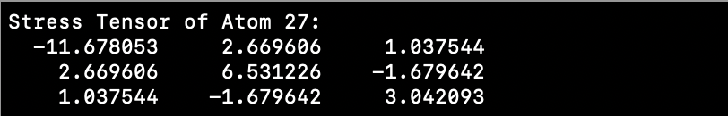
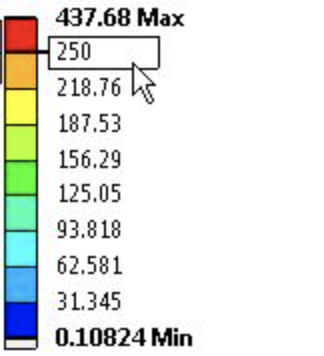

# Final Project: Visualizing Simulations (Extending Assignment 7)

## 🔸Task2: Implementing Color-Coding of Atoms by Velocity in Molecular Dynamics Simulation

### Objective
To enhance the molecular dynamics (MD) simulation visualization by color-coding atoms based on their 3D velocities, mapping these to RGB colors.

### Option1 - OpenGL
The current implementation comprises two main components:
1. **MD Simulation (`md.c`)**: Handles the computation of forces, velocities, and positions of atoms.
2. **Visualization (`atomv.c`)**: Uses OpenGL for rendering the atoms.

### Proposed Modifications
1. **Data Structure Update**:
   - Ensure the atom data structure includes velocity components (Vx, Vy, Vz).

2. **Normalize Velocities in `md.c`**:
   
   - After calculating velocities, normalize them to a 0-1 range.
   - Code snippet for normalization (to be added after velocity computation):
     ```c
     // Normalize velocity components
     double max_velocity = 1.0; // Adjust as needed based on the simulation
     for (int i = 0; i < num_atoms; i++) {
         atoms[i].vx /= max_velocity;
         atoms[i].vy /= max_velocity;
         atoms[i].vz /= max_velocity;
     }
     ```
   
3. **Pass Velocities to Visualization**:
   - Ensure normalized velocities are accessible in `atomv.c`.

4. **Update Visualization in `atomv.c`**:
   - Use velocity components as RGB values.
   - Modify the atom rendering code to set the color based on velocity.
     ```c
     // Example of setting atom color based on velocity
     glColor3f(atoms[i].vx, atoms[i].vy, atoms[i].vz);
     ```

5. **Optional: Dynamic Velocity Scaling**:
   - Implement dynamic scaling to adjust the color intensity based on the range of velocities.

### Compilation and Execution Instructions
1. **Compile the Code**:
   - Use a C compiler (like gcc) to compile the modified `md.c` and `atomv.c`.
   - Example:
     ```bash
     gcc -o md md.c -lm -lGL -lGLU -lglut
     gcc -o atomv atomv.c -lm -lGL -lGLU -lglut
     ```

2. **Run the Simulation**:
   - Execute the MD simulation program (`md`) and then the visualization program (`atomv`).
   - Example:
     ```bash
     ./md < md.in
     ./atomv
     ```

### Testing and Validation
- Test the modified program with different input data to ensure the color mapping accurately reflects the velocities.

### Conclusion
These modifications will enable a visually intuitive representation of atom velocities in the MD simulation, enhancing the understanding of dynamic processes.


### Option2 - VMD simulation
This project involves running a molecular dynamics (MD) simulation, outputting the data including atom velocities, and visualizing the results in VMD with color-coding based on the 3D velocities of the atoms.

### Objectives

- Run MD simulation and output data including atom positions and velocities.
- Process the simulation data to create a color map based on atom velocities.
- Visualize the simulation in VMD with atoms color-coded according to their velocities.

### Simulation Setup

1. **MD Simulation**: The simulation is performed using a custom C program (`lmd.c`) which outputs the positions and velocities of atoms at each timestep.

    - The `lmd.c` program calculates the motion of atoms based on the Lennard-Jones potential and outputs this data in an XYZ format, extended to include velocities.

2. **XYZ File Generation**: The output is a modified XYZ file where each line contains the position and velocity of an atom.

    ```plaintext
    Ar x y z vx vy vz
    ...
    ```

### Data Processing for Color Mapping

1. **Color Map Generation**: A script (e.g., Python) reads the XYZ file, normalizes the velocities, and converts them into RGB values. These values are saved in a separate file, `colors.dat`.

    ```python
    # Python script pseudocode
    # Read velocities, normalize, convert to RGB, write to colors.dat
    ```

2. **Color File**: The `colors.dat` file contains RGB color values corresponding to the velocities of each atom.

### Visualization in VMD

1. **Loading Data into VMD**: Start VMD and load the XYZ file generated by the MD simulation.

2. **Running a Tcl Script in VMD**:

    - Use a Tcl script in VMD to read the RGB values from `colors.dat` and apply them to the atoms.

    ```tcl
    # Tcl script pseudocode
    # Read colors.dat and set atom colors in VMD
    ```

3. **Observing the Results**:

    - After running the script, the VMD display shows atoms color-coded according to their velocities.

### Troubleshooting

- Ensure the paths to data files in the scripts are correct.
- Check the VMD console for errors when running the Tcl script.
- Verify that the color scale in VMD is appropriately set to display the color-coded atoms.

## Simulation Result of Task2:


---


## 🔸Task 3: Animate parallel MD code `pmd.c`

### Introduction
This repository contains the source code and related files for a parallel molecular dynamics (MD) simulation of Lennard-Jones systems using the Message Passing Interface (MPI) standard. The primary objective of this project is to simulate the dynamic behavior of particles under the influence of Lennard-Jones potential and to analyze the system's evolution over time.

### Major Methods and Implementations
The simulation is implemented in C, leveraging the MPI library for parallel computation. The main components of the project include:
- `pmd.c`: The main source file containing the logic for the MD simulation.
- `pmd.h`: Header file defining constants, global variables, and function prototypes.
- `pmd.in`: Input file specifying initial parameters for the simulation.
- `pmd.sl`: A script for submitting the simulation job to a high-performance computing cluster.

#### Overview
The pmd.c program simulates the dynamics of particles interacting via the Lennard-Jones potential using parallel computing with MPI (Message Passing Interface). It models a system of particles in a three-dimensional space where each particle's movement is influenced by its interactions with other particles.

#### Input
The program takes its initial configuration from the `pmd.in` file. This file contains parameters such as:
- The initial unit cell dimensions (InitUcell).
- Density (Density).
- Initial temperature (InitTemp).
- Time step size (DeltaT).
- Total number of time steps to simulate (StepLimit).
- Frequency of reporting average properties (StepAvg).
These parameters are read in the init_params() function.

#### Initialization
- **Setting up the simulation box:** The program initializes the positions of atoms in a face-centered cubic (FCC) lattice and assigns random velocities based on the specified temperature.
- **Domain decomposition:** The simulation space is divided among MPI processes. Each process handles a subset of the entire system.

#### Main Simulation Loop
- **Time stepping:** The single_step() function performs the core of the simulation, updating the positions and velocities of the atoms at each time step using the Velocity-Verlet integration method.
- **Inter-process communication:** Atoms that move across the boundaries of a process's domain are transferred appropriately to neighboring processes (atom_move()).
- **Force computation:** The compute_accel() function calculates the forces acting on each atom due to its neighbors within a certain cutoff radius (defined by the Lennard-Jones potential).

#### Output
- **Data Writing:** The write_xyz() function is called to write the coordinates of the atoms to an output file (output.xyz). This function is invoked by the MPI process with rank 0, ensuring that only one process writes to the file. The output format is suitable for visualization tools to animate the particle movements over time.
- **Property Evaluation:** The eval_props() function evaluates and prints physical properties like temperature, potential energy, and kinetic energy at specified intervals (StepAvg).

#### Parallel Computing Aspects
- **MPI Initialization:** The program begins with initializing MPI and determining the rank of each process.
- **Data Distribution:** Each MPI process works on a subset of the entire atomistic system, which involves calculations specific to its domain and communication with adjacent domains.
- **Synchronization:** MPI barriers and send/receive operations ensure proper synchronization and data transfer among processes.

#### Closing the Simulation
- After completing the specified number of time steps, the program finalizes the MPI environment and exits. The output.xyz file contains the trajectory data which can be used to generate animations or further analyze the molecular dynamics.


### Key Features
- Efficient parallel computation across multiple processors.
- Implementation of the velocity-Verlet integration scheme for time evolution.
- Periodic boundary conditions and spatial decomposition for handling large numbers of particles.

### Results
The results of the simulation are output in the `output.xyz` file, which records the positions of particles at each timestep. This data can be used to visualize the particle trajectories and analyze the system's behavior over time.

### Animation
An animation of the simulation is provided in the repository (in `.mov` format). This animation illustrates the dynamic evolution of the particle system.


### Discussion
The animation of the `pmd.c` simulation offers critical insights into the molecular dynamics of particles interacting via the Lennard-Jones potential. This visualization is instrumental in understanding several key aspects:
- **Particle Dynamics and Interactions:** The animation vividly illustrates how particles move and interact over time. Watching the particles' trajectories and behaviors provides an intuitive understanding of the physical principles at play, such as attraction and repulsion governed by the Lennard-Jones potential.
- **Temporal Evolution:** The animation allows for the observation of the system's evolution over time. This is crucial for identifying transient phenomena and understanding how the system reaches equilibrium, or how it responds to changes in initial conditions.
- **Impact of Simulation Parameters:** The animation makes it easier to comprehend the impact of various simulation parameters, such as particle density, initial temperature, and time step size. These factors critically influence the behavior and stability of the simulated system.
- **Enhancing Comprehension:** As demonstrated in the animation, visual representations are immensely powerful in enhancing our comprehension of complex systems. They allow us to observe and analyze patterns and behaviors that might be non-trivial to discern from raw data or numerical outputs.

In conclusion, the animation of the `pmd.c` simulation is not just a visual aid but a powerful tool for scientific inquiry and education, providing a window into the microscopic world of molecular dynamics.

### How to Run
1. Compile the program using an MPI-compatible compiler:
   ```sh
   mpicc -O -o pmd pmd.c -lm
2. Run the program with slurm script: `pmd.sl`
    ```sh
    sbatch pmd.sl

### Requirements

- An MPI implementation (e.g., OpenMPI, MPICH).
- A C compiler (e.g., GCC).

----

## 🔸Task 4: Visualize Stress Values

### Objective

To expand the capability of our OpenGL-based molecular dynamics simulation visualization program, `mtv.c`, we added a feature that allows for color-coding of stress values of each individual atom.

### Implementation

1. **Compute the 3 x 3 stress tensor of each atom at every timestamp.**

   - 3 x 3 stress vector of the the i-th atom (i = 0, ..., N-1) can be represented as: 
   

   , where N is the total number of atoms, W=L<sub>x</sub>L<sub>y</sub>L<sub>z</sub> is the volume of the simulation box, r<sup>&alpha;&beta;</sup><sub>i</sub>  is the &alpha;-th component of the vector r<sub>ij</sub> = r<sub>i</sub> − r<sub>j</sub> , and u(r) is the is the Lennard-Jones potential function
   
   - Example stress vector being calculated:
      

   - Code Snippet:
      ```c
      void SingleStep() {
         ...
         ComputeAccel();
         HalfKick();
         ComputeStressTensor();  /* function that computes the 3x3 stress tensor */
         }
      ```

2. **Calculate the Von Mises Stress of each atom.** 

   - Von Mises stress is a scalar value derived from the stress tensor that is often used to represent magnitude of the stress tensor

   - Code snippet:
     ```c
     double CalculateStressMagnitude(double stressTensor[3][3]) {
         double magnitude = 0.0;
         for (int i = 0; i < 3; ++i) {
             for (int j = 0; j < 3; ++j) {
                 magnitude += stressTensor[i][j] * stressTensor[i][j];
             }
         }
         return sqrt(magnitude);
     }
     ```

3. **Map Stress Tensor Magnitude to Colors.** 
   
   - Implemented a function that maps the stress tensor magnitude to a color. 

   - Inspired by the color scale commonly used by finite element analysis software such as Ansys
      

   - Code snippet:
     ```c
     void MapStressToColor(double magnitude, float color[3]) {
     
         // normalize the magnitude to [0, 1]
         double normalizedStress = (magnitude - minStress) / (maxStress - minStress);
     
         if (normalizedStress < 0.25) {
             // blue to cyan
             color[0] = 0.0; 
             color[1] = 4 * normalizedStress;
             color[2] = 1.0; 
         } else if (normalizedStress < 0.5) {
             // cyan to green
             color[0] = 0.0;
             color[1] = 1.0; 
             color[2] = 1.0 - 4 * (normalizedStress - 0.25);
         } else if (normalizedStress < 0.75) {
             // green to yellow
             color[0] = 4 * (normalizedStress - 0.5); 
             color[1] = 1.0;
             color[2] = 0.0;
         } else {
             // yellow to red
             color[0] = 1.0; 
             color[1] = 1.0 - 4 * (normalizedStress - 0.75); 
             color[2] = 0.0; 
         }
     }
     ```

4. **Render Atoms with Color Coding.** 

   - Within the main rendering loop, update the color for each atom as determined by magnitude of the stress

   - Code snippet for updating the color for each atom:
     ```c
     void makeAtoms() {
       float color[3];
       ...
       for (i=0; i < nAtom; i++) {
         double magnitude = CalculateStressMagnitude(stressTensor[i]);
         MapStressToColor(magnitude, color);
         ...
       }
       ...
     }

     void makeCurframeGeom() {
       makeAtoms();
     }
     ```
     - Code snippet for the main rendering loop:
     ```c
     void animate() { 
         /* Keep updating the scene until the last MD step is reached */
         if (stepCount <= StepLimit) {
             ...
             makeCurframeGeom(); /* Redraw the scene (make a display list) */
             ...
         }
     }
     ```

### Simulation Result


### Discussion
In the OpenGL-based molecular dynamics visualization program `mdv.c`, we have implemented a color-coding scheme that enhances the interpretability of atomic interactions. This program visually distinguishes between various stress levels experienced by individual atoms: blue represents regions of low stress, while red indicates areas of high stress. 

### Conclusion

By color-coding stress level experienced by individual atoms, we improves the visual interpretability of atomic interactions, enabling a more intuitive understanding of molecular dynamics. This feature can be particularly beneficial for educational purposes, where it can be used to demonstrate the molecular behavior under different conditions.

### Compilation and Execution Instructions

1. **Go To the Folder**:
   ```bash
   cd Task4_ColorCodeStress
   ```

2. **Compile the Code**:

   ```bash
   cc -o mdv mdv.c -framework OpenGL -framework GLUT -w
   ```

2. **Run the Simulation**:

   ```bash
   ./mdv < md.in
   ```
### Requirements

- GCC compiler  
- OpenGL environment